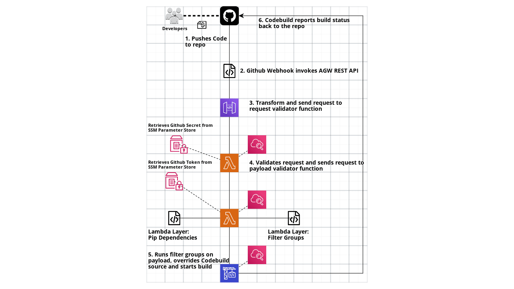

# dynamic-github-source

## Problem ##

Current implementation of AWS CodeBuild doesn't allow for dynamic repo and branch source. CodeBuild does allow for up to 12 secondary sources, although the buildspec would have to have additional logic to explicitly switch to the secondary source that was trigger via the CodeBuild Webhook. Another painful workaround is to create a Codebuild project for each repository. If each repo requires the same CodeBuild configurations, this can lead to multiple copies of the same CodeBuild project but with different sources. This can consequently clutter your AWS CodeBuild workspace especially if there are hundreds of repositories are included in this process.

## Process ##



### Steps ###

1. Github event is performed (e.g. user pushes new file, opens PR, etc.) that falls under one of the repository's event filters
2. Github webhook sends a POST HTTP method request to the API Gateway's (AGW) REST API 
3. AGW request integration maps the request to a format friendly format `{'headers': <Webhook headers>, 'body': <Webhook payload>}` Processed request is passed to the request validator function that compares the `sha256` value from the request header with the `sha256` value created with the Github secret value and request payload. If the values are equal, the Lambda function succeeds.
5. The payload validator Lambda function is invoked asynchronously on success of the request validor Lambda Function. Payload validator function compares the payload to the filter groups. If the payload passes one of the filter groups, the Codebuild project is kicked off with the triggered repository's CodeBuild configurations ONLY for this build (after this build, CodeBuild project reverts to original configurations). The main attribute that is changed is the source configurations for the build. 
6. CodeBuild performs the defined buildspec logic. User can define a global or repo-level buildspec that can be used for CI/CD, building AMIs, etc. 

## Non-Provider related Requirements
- The environment in which the Terraform module is applied must have pip within it's `$PATH`. The `resource "null_resource" "lambda_pip_deps" {}` installs the `PyGithub` package locally and then is used within the payload validator function. 

## Usage

Minimal viable configuration:

```
module "dynamic_github_source" {
  source                         = "github.com/marshall7m/terraform-aws-codebuild/modules//dynamic-github-source"
  create_github_secret_ssm_param = true
  github_secret_ssm_value        = var.github_secret_ssm_value
  github_token_ssm_value         = var.github_token
  codebuild_buildspec            = file("buildspec.yaml")
  repos = [
    {
      name = "test-repo"
      filter_groups = [
        {
          events     = ["push"]
        }
      ]
    }
  ]
}
```

Configure repo specific codebuild configurations via `codebuild_cfg` within `repos` list:

```
module "dynamic_github_source" {
  source                         = "github.com/marshall7m/terraform-aws-codebuild/modules//dynamic-github-source"
  create_github_secret_ssm_param = true
  github_secret_ssm_value        = var.github_secret_ssm_value
  github_token_ssm_value         = var.github_token
  codebuild_name                 = "test-codebuild"
  codebuild_buildspec            = file("buildspec.yaml")
  repos = [
    {
      name = "test-repo"
      codebuild_cfg = {
        environment_variables = [
          {
            name  = "TEST"
            value = "FOO"
            type  = "PLAINTEXT"
          }
        ]
      }
      filter_groups = [
        {
          events     = ["push"]
          file_paths = ["CHANGELOG.md"]
        },
        {
          events     = ["pull_request"]
          pr_actions = ["opened", "edited", "synchronize"]
          file_paths = [".*\\.py$"]
          head_refs  = ["test-branch"]
        }
      ]
    }
  ]
}
```